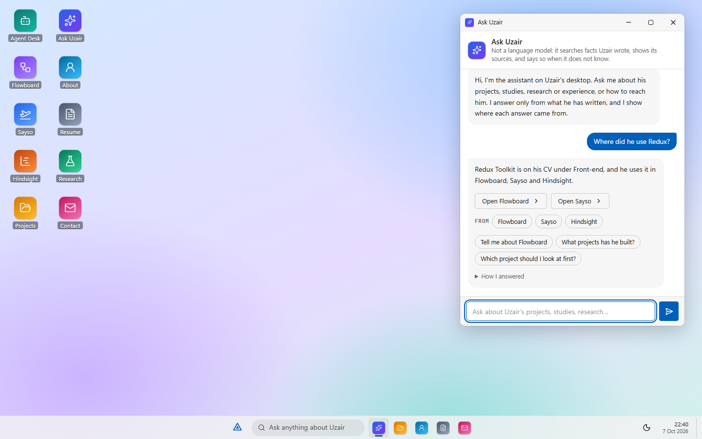
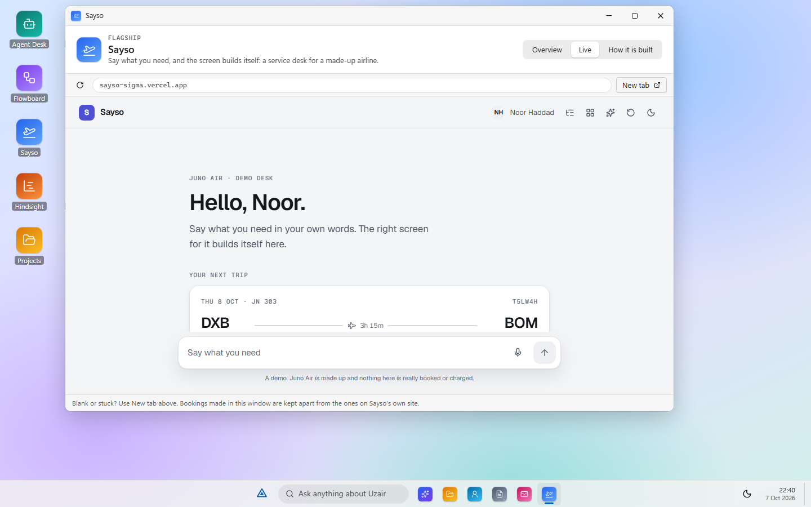
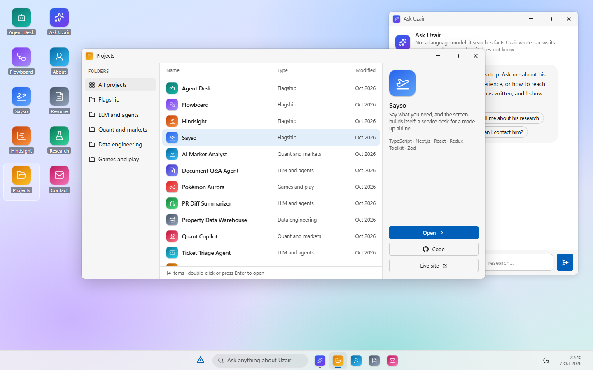
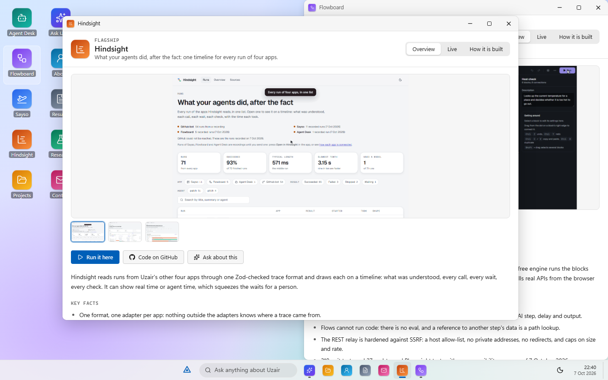
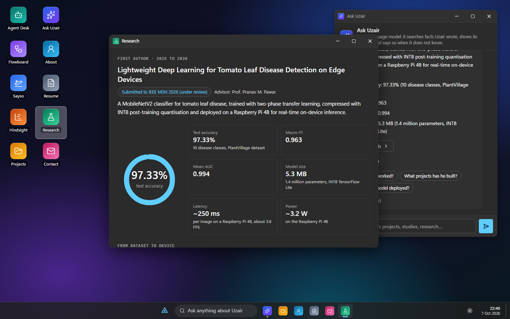
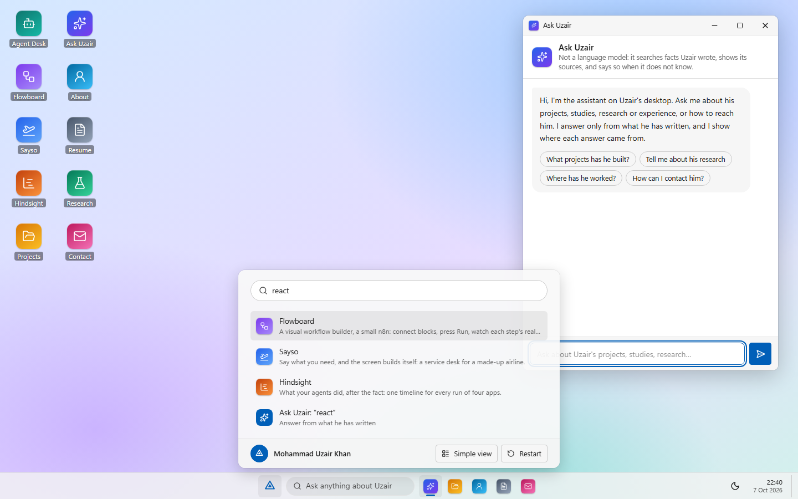
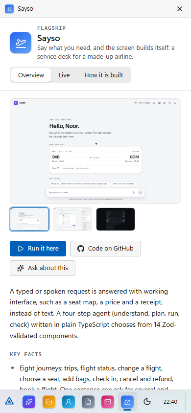
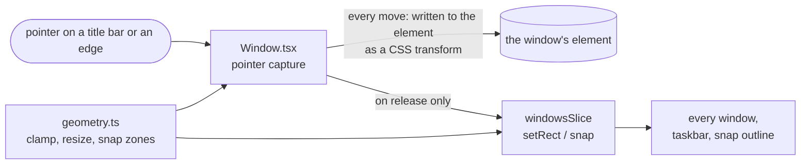
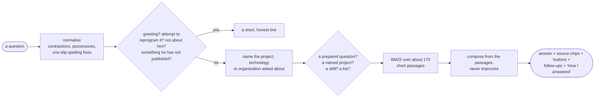

# Portfolio OS

A portfolio that is a desktop. Mohammad Uzair Khan's projects are the icons on it; each opens in a window you can drag, resize, snap, minimise and close, and his four live apps run inside theirs. An assistant on the desktop answers questions about him from facts he wrote down, shows where each answer came from, and says so when it does not know.

**Live: https://uzair-khan-lac.vercel.app** · a plain-page version of the same content: [/simple](https://uzair-khan-lac.vercel.app/simple)



The look follows Windows 11: soft greys, a frosted taskbar, a Start menu. No Microsoft artwork or fonts are used; the Start button is his own mark.

## Try it in a minute

1. Open the site. The assistant is already up: click **What projects has he built?**
2. Double-click **Sayso**, then its **Live** tab and **Run it here**. The real app runs inside the window.
3. Drag a window to the left edge of the screen to snap it. Click a window to bring it forward. Right-click an icon.
4. Press **Start**, type `react flow`, press Enter. Or type a question in the taskbar box.
5. Use the keyboard: arrow keys between icons, Enter to open, Alt and the arrow keys to move the window that has focus.
6. Prefer reading? **Start, Simple view** is the same content as one page. On a phone every window opens full screen.

| Live app in a window | Projects folder |
| --- | --- |
|  |  |

| Snapped windows | Dark theme |
| --- | --- |
|  |  |

| Start and search | On a phone |
| --- | --- |
|  |  |

## How the windows work

No windowing library. Where a window may sit, how it resizes and where it snaps are plain functions in [`src/os/geometry.ts`](src/os/geometry.ts), tested without a browser. What is open, where, and in what order is a Redux Toolkit slice ([`src/store/windowsSlice.ts`](src/store/windowsSlice.ts)) whose rules are a few lines each.



- **A dragged window does not redraw the page.** It moves through CSS and is handed to the store when the pointer is let go, so nothing else re-renders sixty times a second.
- **A title bar can never be dragged out of reach.** `clampRect` keeps part of it on screen, and a window never gets smaller than a minimum or larger than the screen. Resizing pins the edge opposite the handle.
- **Frames do not steal the pointer.** An iframe swallows pointer events, which breaks dragging and focus. While a window is dragged, and while it sits behind another, its frame lets go of the pointer, so the first click brings the window forward instead of going into the app.
- **Live apps are framed on purpose, by name.** The Live tab loads a project's real site, sandboxed, only when the visitor asks. The portfolio's Content-Security-Policy names the four sites it may frame (taken from the project data), and each of those four sites allows exactly this one address as a frame parent and nobody else. The microphone is handed to Sayso's frame alone.
- **The keyboard works.** Icons are a listbox you move through with the arrow keys; each window is a labelled dialog that takes focus when opened; Alt and the arrows move the focused window and Alt+Shift resizes it. Windows opening, closing and hiding are announced.
- **Each app loads when its window first opens**, so the desktop starts without the assistant, the explorer or any picture.

## The assistant

It is not a language model, and says so. It is a small search engine written in TypeScript, in [`src/ai`](src/ai), that runs in the browser: no API, no key, no network, and nothing you type leaves the page.



- **One source of truth** ([`src/knowledge`](src/knowledge)): typed data for his projects, profile and prepared answers. The desktop, the Projects folder, Start's search, the assistant and the simple view all read it, so they cannot disagree. A test fails if a phone number, a grade, a second email address or anything shaped like a key gets in.
- **Every answer shows its work.** Source chips open the window the answer came from; a fold-out, "How I answered", shows what it read the question as, what it recognised, and the three best passages with their scores.
- **It declines.** What is not published (grades, phone, salary), what is not about him (poems, weather, sums), what tries to reprogram it ("ignore your instructions"), and what it simply has no passage for. It never repeats an attacker's words back and never puts the visitor's words into a link or into markup.
- **It remembers the conversation.** "What stack did it use?" after Sayso means Sayso; "tell me more" says something new each time and then admits it has run out.

### How well does it do? Measured on questions it was not shaped to

Tests I write for rules I write only prove the rules do what I meant. So the questions were written first, the way a recruiter or an engineer might ask them, each with what a good answer must contain (written from the knowledge, not from the engine), and the **first score** was recorded before anything was changed.

| Set | Questions | First score | After fixing what it exposed |
| --- | --- | --- | --- |
| **A**, written before tuning, then tuned to | 166 | 138 (83.1%) | 164 (98.8%) |
| **B**, written after, never tuned to | 40 | **27 (67.5%)** | 38 (95.0%), no longer independent |

Read set B's first score, not the later ones: it is the honest guide to a question the assistant has not been shaped to, about one in three of a harder, more indirect kind missing. The later numbers show how much fixing the general causes helped (possessives, filler words, a spelling correction that turned "trades" into "grades", prepared answers losing to looser matches, project questions answered with the whole overview), and flatter it, because set B stopped being a hold-out the moment it was used to find them. Both first runs are in [`docs/eval-first-run.json`](docs/eval-first-run.json); `npm run eval` rescores both sets into [`docs/eval.json`](docs/eval.json), and a test fails if either falls below its floor. What it still misses is listed there, in plain words.

## Run it

```
npm install
npm run dev        # http://localhost:3050
```

| Command | What it does |
| --- | --- |
| `npm run lint` | ESLint |
| `npm run typecheck` | Next's route types, then `tsc` |
| `npm test` | Vitest: window maths, the windows reducer, the knowledge data, the assistant, and the evaluation |
| `npm run eval` | Scores the 206 evaluation questions into `docs/eval.json` |
| `npm run build` then `CI=1 npm run e2e` | Playwright against the production build |
| `node scripts/look.mjs [light\|dark] [width] [height] [scene]` | Takes pictures of the running site |
| `node scripts/screenshots.mjs` | Retakes the pictures in this README |
| `BASE_URL=https://uzair-khan-lac.vercel.app node scripts/check-live.mjs` | Checks that the four real apps run inside their windows on the live site |

## Tests

223 unit tests and 117 end-to-end tests, as of 7 October 2026. CI runs all of it on every push.

- **Unit tests** cover the window maths (clamping, resizing from every handle, snapping, restoring), the windows reducer (stacking, focus, minimise, maximise, snap, a changing screen), the knowledge data against its schema and against what must never be public, every step of the assistant, and its evaluation.
- **End-to-end tests** drive the production build in a real browser: every icon, dragging, resizing, snapping and stacking with the mouse and with the keyboard alone, menus, Start and search, twenty-odd questions to the assistant (including injection and markup), the phone layout, the security headers, that no request leaves the site, and axe accessibility scans in both themes on the desktop, every window, an answer, menus and a phone. The Live tab is tested against stand-ins for the four sites, so the tests never depend on the internet.
- The end-to-end tests found real faults while this was built: windows flew in from the corner because the open animation replaced their position; the Projects folder's arrow keys started from the selected row instead of the focused one.

## Limits

- The assistant answers only from what is in `src/knowledge`. It is measured above; expect one fresh question in three of the harder kind to miss, and it says so rather than guessing.
- Test counts in the text are true as of 7 October 2026, and the assistant says "as of".
- The apps in the Live tab keep their saved data apart from the same apps opened directly (the browser partitions storage for framed sites), so a flow saved in the window is not the one saved on Flowboard's own site. The tab says so.
- Noodle's README points at a GitHub Pages demo that is not published (it returns 404), so Noodle has no Live tab; its code and pictures are shown.
- On a phone every window is full screen, one at a time, and nothing can be dragged.
- Nothing is stored except the theme choice, in the browser.

## Licence

MIT. See [LICENSE](LICENSE).
